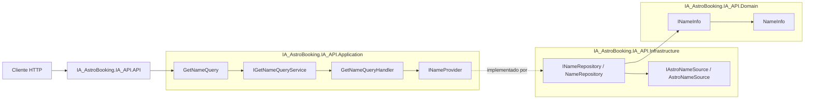

# IA_AstroBooking

Solucion de ejemplo en .NET 10 para una Web API con arquitectura en 4 capas, aplicando principios SOLID, patron CQRS para consultas y documentacion OpenAPI con Swagger.

## Solucion Implementada

- Nombre de la solucion: `IA_AstroBooking.IA_API`
- Framework objetivo: `net10.0`
- Tipo de arquitectura: limpia por capas (Domain, Application, Infrastructure, API)

## Arquitectura por Capas

La solucion separa responsabilidades para mantener bajo acoplamiento y alta cohesion.

### 1) Domain

Proyecto: `IA_AstroBooking.IA_API.Domain`

Responsabilidad:
- Contiene contratos y entidades del dominio.
- No depende de ningun otro proyecto.

Ejemplos implementados:
- `Contracts/INameInfo.cs`
- `Entities/NameInfo.cs`

### 2) Application

Proyecto: `IA_AstroBooking.IA_API.Application`

Responsabilidad:
- Define casos de uso y logica de aplicacion.
- Implementa CQRS para consultas.
- Depende solo de Domain.

Ejemplos implementados:
- Abstracciones CQRS:
  - `Abstractions/CQRS/IQuery.cs`
  - `Abstractions/CQRS/IQueryHandler.cs`
- Puerto de salida (interfaz hacia infraestructura):
  - `Abstractions/INameProvider.cs`
- Feature CQRS de ejemplo:
  - `Features/GetName/GetNameQuery.cs`
  - `Features/GetName/GetNameQueryHandler.cs`
  - `Features/GetName/GetNameQueryService.cs`
  - `Features/GetName/IGetNameQueryService.cs`
  - `Features/GetName/GetNameResponse.cs`

### 3) Infrastructure

Proyecto: `IA_AstroBooking.IA_API.Infrastructure`

Responsabilidad:
- Implementa contratos definidos por Application.
- Contiene detalles tecnicos y acceso a datos/fuentes externas.
- Depende de Application y Domain.

Ejemplos implementados:
- Repositorio:
  - `Repositories/INameRepository.cs`
  - `Repositories/NameRepository.cs`
- Fuente de datos:
  - `Services/IAstroNameSource.cs`
  - `Services/AstroNameSource.cs`

### 4) API

Proyecto: `IA_AstroBooking.IA_API.API`

Responsabilidad:
- Exponer endpoints HTTP y configuracion del host.
- Orquestar DI y middleware.
- Depende de Application e Infrastructure.

Ejemplo implementado:
- Controlador GET:
  - `Controllers/GetNameController.cs`
- Configuracion principal:
  - `Program.cs`

## Reglas de Dependencias

Dependencias entre proyectos:

- `IA_AstroBooking.IA_API.Domain` -> sin dependencias internas
- `IA_AstroBooking.IA_API.Application` -> `IA_AstroBooking.IA_API.Domain`
- `IA_AstroBooking.IA_API.Infrastructure` -> `IA_AstroBooking.IA_API.Domain`, `IA_AstroBooking.IA_API.Application`
- `IA_AstroBooking.IA_API.API` -> `IA_AstroBooking.IA_API.Application`, `IA_AstroBooking.IA_API.Infrastructure`

Esto asegura que el dominio se mantenga independiente del resto de capas.

## Diagrama de Arquitectura



## Tecnologias Utilizadas

- .NET SDK `10.0.x`
- ASP.NET Core Web API
- Swagger / OpenAPI con `Swashbuckle.AspNetCore`
- xUnit para pruebas unitarias
- Inyeccion de dependencias nativa de Microsoft

## Patrones y Principios Aplicados

- Clean Architecture (por capas)
- CQRS para consultas (query + query handler + query service)
- SOLID:
  - SRP: cada clase con una sola responsabilidad.
  - OCP/DIP: uso de interfaces y abstracciones entre capas.
  - ISP: contratos pequenos y especificos.

## Proyecto de Pruebas

Proyecto: `IA_AstroBooking.IA_API.Application.Tests`

Incluye pruebas unitarias del QueryHandler de ejemplo:
- `Features/GetName/GetNameQueryHandlerTests.cs`

## Ejecucion Local

Compilar solucion:

```bash
dotnet build IA_AstroBooking.IA_API.slnx
```

Ejecutar pruebas:

```bash
dotnet test IA_AstroBooking.IA_API.slnx
```

Levantar API:

```bash
dotnet run --project IA_AstroBooking.IA_API.API
```

Swagger UI queda disponible en la URL que informe la aplicacion al iniciar (por ejemplo `/swagger`).

## Instrucciones de creación del proyecto 
- Crear webapi llamada IA_AstroBooking.IA_API.API con framework net10.0
- Necesito crear una solución llamada IA_AstroBooking.IA_API de 4 capas en net10.0
- Crea la libreria de clases llamada IA_AstroBooking.IA_API.Domain en net10.0
- Crea la libreria de clases llamada IA_AstroBooking.IA_API.Application en net10.0
- Crea la libreria de clases llamada IA_AstroBooking.IA_API.Infrastructure net10.0
- agregar referencia IA_AstroBooking.IA_API.Application/IA_AstroBooking.IA_API.Application.csproj reference IA_AstroBooking.IA_API.Domain/IA_AstroBooking.IA_API.Domain.csproj --> Dominio es independiente de los demas proyectos
- agregar referencia IA_AstroBooking.IA_API.Infrastructure/IA_AstroBooking.IA_API.Infrastructure.csproj reference IA_AstroBooking.IA_API.Domain/IA_AstroBooking.IA_API.Domain.csproj
- agregar referencia IA_AstroBooking.IA_API.Infrastructure/IA_AstroBooking.IA_API.Infrastructure.csproj reference IA_AstroBooking.IA_API.Application/IA_AstroBooking.IA_API.Application.csproj
- agregar referencia IA_AstroBooking.IA_API.API/IA_AstroBooking.IA_API.API.csproj reference IA_AstroBooking.IA_API.Application/IA_AstroBooking.IA_API.Application.csproj IA_AstroBooking.IA_API.Infrastructure/IA_AstroBooking.IA_API.Infrastructure.csproj
- Crear un controllador de ejemplo GET llamado GetNameController.cs Este controlador se debe conectar con IA_AstroBooking.IA_API.Application y crar un método incluyendo CQRS
- El método de IA_AstroBooking.IA_API.Application se comunica con IA_AstroBooking.IA_API.Infrastructure
- la implementacion de cada capa tiene que tener Interfaces
- implementar Swagger al proyecto


## Author

- [Manuel Baeza Sanhueza](https://www.linkedin.com/in/manuel-baeza-b0a00336/)